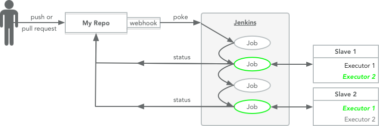

# CIMR: CI Made Reliable

Suppose I want to...

- run a set of tests on a Pull Request before merging it;
- make a "release" whenever a release-tag is pushed to a branch; or
- update a configuration whenever new settings are pushed to a
  repository.

These tasks share a pattern, Jenkins runs jobs when an event (push,
PR) occurs in a GitHub repository.



I'd like to set up a Jenkins server to do this, replicate it without a
fuss, run it without intervention, and make changes without being
surprised.

> Reliable: giving the same result on successive trials.<br/>
> [Merriam-Webster](https://www.merriam-webster.com/dictionary/reliable)

In short, I'd like it to be reliable.

Jump to ['Setting up a CIMR instance'](#setting-up-a-cimr-instance) if
you just want to get going.

### Jenkins is complex and hard

In [Simple Made Easy][sme] ([transcript][sme-transcript]) Rich Hickey
draws a distinction between two orthogonal concepts: simplicity and
difficulty.  **Simplicity** is an objective measure of interleaving;
*simple* things focus on a single concern while *complex* things
involve multiple entwined concerns.  **Difficulty** is a relative
measure of familiarity; familiar concepts are *easy* while new
material is *hard*.  Simplicity is a characteristic of a thing,
difficulty is relative to a thing's consumer.

Hickey argues that understanding something is a prerequisite for
making it reliable and that both complexity and difficulty work
against understanding.

*Jenkins is complex*; its history, plugin architecture, and open
source development process have resulted in a system with myriad
interconnections.

*Jenkins is hard*; its interfaces are confusing, its documentation is
inconsistent and setting it up requires non-obvious skills.

Reliable Jenkins installations are challenging.  Making Jenkins
simpler and easier would make reliable installations less problematic.

### CIMR is simpler and easier

Jenkins is an extensible system, providing mechanisms without
specifying policy (Pandora's Box).

CIMR uses an *opinionated* subset of Jenkins' capabilities to provide
a minimal service that can run the jobs described above.

By limiting scope and prescribing a particular configuration it
becomes *simpler*.

By documenting and automating its configuration it becomes *easier*.

Simplicity and ease lead to reliability.

## The solution

- Script everything, avoid using the Jenkins GUI for setup or
  maintenance.
- Run an ephemeral Jenkins master in a Docker container, built from a
  standard image and configured via an initialization script and a
  YAML file.
- Only configure two users and two levels of authorization (`admin`
  and `anonymous`) -- replication without fuss means that groups that
  need isolation can be given separate systems.
- Configure one or more Jenkins slaves that communicate with the
  master via SSH.
- Use the GitHub and the GitHub Pull Request Builder plugins to
  automatically manage GitHub webhooks and trigger builds.
- Use the Jenkins Job DSL to programmatically manage jobs.

## The components

- GitHub (or a GitHub Enterprise instance)
- one or more GitHub repositories
- a GitHub user with owner/admin access to the repositories
- a Jenkins master running in a Docker container
- one or more slave systems
- an account on the slave systems

## Setting up a CIMR instance

The devil is in the details.  CIMR's minimalism reduces this problem,
but you still need to get all of the bits in the right place.  The
instructions and checklists below help this happen.

I suggest that you:

1. skim the steps below so that you know what you're getting into; and then
2. work through them in order, completing each checklist *before*
   trying to move on to the next step.

If you do, you'll find that at each step you have all of the
information you need to move forward.

#### Checklist

- [ ] I'm on board with the idea of doing these steps in order.

### Decide how to manage secrets

The CIMR configuration depends on four pieces of information that
might be sensitive: the admin password on the Jenkins master, the
GitHub access token, the private part of the GitHub SSH key, and the
private part of the master-slave SSH key.

Anyone with access to these secrets can run processes on the slave
system as the specified user and manipulate accessible repositories on
GitHub.  These abilities could be used to gain additional access.

*This information should be handled appropriately*.  You should decide
what is appropriate.

A simple, basic approach is to keep the secrets private and not share
control of the instance with anyone you don't completely trust.  CIMR
instances are lightweight and easy to set up, give them one of their
own.

You might consider using dedicated "service" accounts on GitHub and
the slave systems instead of using your personal account.

If that sounds good to you:

1. store the sensitive information in files that only the trusted user
   (you, or a service account) can read, on the theory that anyone who
   can read the files can already impersonate that user; and
2. pass the info into the Docker container via environment variables
   to avoid poorly protected copies existing on durable storage.

The sample `docker-run.sh` script implements this technique, looking
for files containing the secrets in a `~trusted-user/.cimr-secrets`
directory.  Ensure that only the trusted user can read this directory.
E.g.:

```sh
mkdir ~trusted-user/.cimr-secrets
chmod 700 ~trusted-user/.cimr-secrets
```

Don't share the Jenkins `admin` password with anyone you don't trust
with access to the (your) account.  If you do, they can create jobs
and run them using its (your) credentials.

More complicated approaches might be worth considering (that sentence
should make you *itch* a bit...).

#### Checklist

- [ ] You've decided on an approach to handling your secrets and you
  know where you'll be storing:
  - [ ] the GitHub Personal Access Token
    (e.g. `~trusted-user/.cimr-secrets/github-access-token`),
  - [ ] the Jenkins `admin` password
    (e.g. `~trusted-user/.cimr-secrets/admin-password`),
  - [ ] the private part of the Jenkins<->GitHub SSH key
    (e.g. `~trusted-user/.cimr-secrets/git-key`), and
  - [ ] the private part of the Jenkins<->slaves SSH key
    (e.g. `~trusted-user/.cimr-secrets/ssh-key`).

### Set up a repository to manage this CIMR instance

You'll need a place to keep a `README.md` that describes this instance,
its `cimr_config.yaml` file and its `jobs.groovy` job definition
script.

You should create a repository on your GitHub instance and add a
`README.md`.  We'll add the other files below.

Here's a sample `README.md`, you can adjust it to suit your needs:

```md
# A demo CI Made Reliable setup

This contains the specific bits needed to use CIMR to set up a CI
demo.

See [cimr](https://github.com/hartzell/cimr) for a discussion of how to
use CIMR.

This directory contains:

- `README.md` -- this bit of documentation.
- `cimr_config.yaml` -- the cimr configuration file.
- `docker-run.sh` -- the script for starting the Jenkins docker
  container.
- `jobs.groovy` -- the Jobs DSL script watched by the seed job,
  defines all of the other jobs and views.
```

CIMR will set a webhook in this repository that runs the Job DSL seed
job, which processes the `jobs.groovy` script, any time the repository
is updated.

#### Checklist

- [ ] You have a repository on your GitHub host for the CIMR
  configuration info,
  - [ ] you've added a `README.md`.

### Commit to a service URL

Decide on the URL you'll use for the Jenkins service.  Part of
committing to the URL is deciding where and how you'll be running the
Jenkins master container.

An example might be:

```
http://myhost.mydomain.com:4242/jenkinses/team-alpha/project-a
```

In a simple setup this choice requires that you run the Docker
container on `myhost.mydomain.com`, map the host port `4242` to the
container's port `8080`, and that you include the
`--prefix=/jenkinses/team-alpha/project-a` option when you start
Jenkins (the "prefix" is the [path component][url-syntax] of the URL).

More complex (*itch*) scenarios involving reverse proxies and/or
"container orchestration engines" (a Hod, Mesos) are also possible and
might actually be simpler as the number of CIMR instances scales.

#### Checklist

- [ ] You've decided on the URL for the Jenkins master, including:
  - [ ] the hostname: ________________
  - [ ] the port: _________________, and
  - [ ] the prefix: ________________.

### The CIMR Docker image

Build a Docker image using this repository's Dockerfile, providing an
appropriate name and tag.  You should update the maintainer in the
`Dockerfile`.  E.g.

```sh
# use a reasonable name and tag...
docker build -t cimr:x.y.z .
```

If you didn't build it on the machine on which it will run, you should
push it to a convenient registry.

#### Checklist

- [ ] You've created a Docker image, and
  - [ ] ensured that it's available to the daemon that will run it
    (locally or via a registry).

### The GitHub user

Select or create a GitHub user with owner/administrator access to the
repositories you'll be using (including the CIMR configuration
repository you created above).  You might use your account or a
dedicated service account or &hellip;.

Create an SSH key and add the public part to the trusted user's GitHub
account ([instructions here][github-ssh-key], don't worry about the
ssh-agent bit).  Save the private part in a safe place, CIMR will
store it in a Jenkins credential named `git-key`.  E.g.:

```sh
ssh-keygen -a 100 -t ed25519 -f ~trusted-user/.cimr-secrets/git-key
```

Create a Personal Access Token ([instructions here][github-token])
with scopes that include `repo:status`, `repo:public_repo`,
`read:org`, and `admin:repo_hook`.  Substitute `repo` scope for
`repo:status` and `repo:public_repo` if you're working with private
repositories.  Save it in a safe place
(e.g. `~trusted-user/.cimr-secrets/github-api-token`), CIMR will store
it in a Jenkins credential named `github-api-token`.

#### Checklist

- [ ] You have a GitHub user
  - [ ] that will have owner/admin access to the CIMR configuration
    repository, and
  - [ ] owner/admin access to the other repositories that will
    trigger builds;
- [ ] you've created an SSH key, added the public part to the GitHub
  user's account and stashed the private part someplace safe
  (e.g. `~trusted-user/.cimr-secrets/git-key`); and
- [ ] you've created a Personal Access Token with the appropriate
  scopes for the GitHub user and stashed it someplace safe
  (e.g. `~trusted-user/.cimr-secrets/github-api-token`).

### The slave system account

Select or create an account that will run the Jenkins jobs on the
slave systems.  You might use your account or a dedicated service
account or &hellip;.

Create an SSH key for that account and stash it someplace safe.  E.g.

```sh
# the slave user might be the same account as the trusted-user...
ssh-keygen -a 100 -t ed25519 -f ~slave-user/.cimr-secrets/slaves-key
```

We'll add the public part to the `authorized_keys` file on the slave
hosts and CIMR will store the private part in a Jenkins credential
named `slaves-key`.

#### Checklist

- [ ] You have an account set up on the slave systems; and
- [ ] you've created an SSH key and stashed it someplace safe
  (e.g. `~slave-user/.cimr-secrets/slaves-key`).

### The slave systems

Select one or more systems to use as slaves.  Make a note of their
names (or IP addresses) and the public part of their RSA host keys
(`/etc/ssh/ssh_host_rsa_key.pub`), you'll need to add them to
`cimr_config.yaml` in a later step.

Add the public part of the slave system account's SSH key to the
authorized keys file (`~slave-user/.ssh/authorized_keys`) on each of
the slave systems.  E.g.

```sh
cat ~trusted-user/.cimr-secrets/slaves-key.pub >> ~slave-user/.ssh/authorized_keys
```

Create a directory on each system to use as the Jenkins working
directory, it must be readable/writable by the slave account created
above.

#### Checklist

- [ ] You've identified a set of slave systems;
- [ ] made note of where to find the public part of their RSA host
  keys;
- [ ] added the public part of the slave account's SSH key to the
  `~slave-user/.ssh/authorized_hosts` file on each slave system; and
- [ ] created distinct working directories that are `rwx` for the
  slave account on each of the slave systems.

### Choose a Jenkins admin user password

The Jenkins admin user needs a password.  You should choose one and
stash it someplace safe (e.g. `~trusted-user/.cimr-secrets/admin-password`).

#### Checklist

- [ ] You've settled on a password for the Jenkins admin user, and
  - [ ] you've stashed it someplace safe
    (e.g. `~trusted-user/.cimr-secrets/admin-password`).

### Assemble a script to start the Jenkins master

When you decided on the service URL you also thought through how you'd
be running the Jenkins master's container.  Now you should set up a
script that starts it.

We'll illustrate the direct approach, running it directly via Docker
(using the image created above):

```sh
docker run [options described below] cimr:x.y.z
```

There are a bunch of options you might want to set, explained and
illustrated below (you'll want to localize the examples to e.g. use
names and paths that are meaningful in *your* setup).

It's convenient to give the container a name, it should run in the
background and it should try to restart itself if it fails, so the
options should include:

```sh
  --name demo-cimr --detach --restart=on-failure:5
```

The initialization script expects the configuration file to be
available in the root directory, so the options should include
(adjust as necessary):

```sh
  -v /path/to/cimr_config.yaml:/cimr_config.yaml
```

You'll need to map the port you want people to use (e.g. 4242) to the
port inside the container on which Jenkins listens (e.g. 8080), so the
options should include:

```sh
  -p 4242:8080
```

You may choose to pass command line options to Jenkins via the
`JENKINS_OPTS` environment variable.

In particular, if the [path component][url-syntax] of your Jenkins URL
is non-empty, you need to inform Jenkins via the `prefix` option, if
which case the options should include:

```sh
  -e JENKINS_OPTS="--prefix=/jenkinses/team-alpha/project-a/"
```

And finally, you may choose to pass secrets into the container via
environment variables instead of setting them in `cimr_config.yaml`,
in which case the options should include:

```
  -e JENKINS_SLAVES_PRIVATE_KEY \
  -e JENKINS_GIT_PRIVATE_KEY \
  -e JENKINS_GITHUB_TOKEN \
  -e JENKINS_ADMIN_PASSWORD \
```

Here's a sample script that does the things above, it assumes that
you'll start it in a directory that contains the `cimr_config.yaml`
file and it reads your secrets from files in
`~trusted-user/.cimr-secrets`.  You can't use it as is, but you could
copy it and update each line to match your situation.

```sh
#!/bin/bash

# simple error checking, complain about using unset variables
set -o errexit
set -o nounset

# Perhaps this should be path to $0...
mydir=$(pwd)

# Set vars and export them in separate stmts so errexit can catch
# errors, e.g. missing files.
JENKINS_GIT_PRIVATE_KEY="$(cat $HOME/.cimr-secrets/git-key)"
JENKINS_SLAVES_PRIVATE_KEY="$(cat $HOME/.cimr-secrets/slaves-key)"
JENKINS_GITHUB_TOKEN="$(cat ${HOME}/.cimr-secrets/github-api-token)"
JENKINS_ADMIN_PASSWORD="$(cat ${HOME}/.cimr-secrets/admin-password)"
export JENKINS_GIT_PRIVATE_KEY JENKINS_SLAVES_PRIVATE_KEY \
       JENKINS_GITHUB_TOKEN JENKINS_ADMIN_PASSWORD

docker run \
  --name demo-cimr \
  --detach \
  --restart=on-failure:5 \
  -v ${mydir}/cimr_config.yaml:/cimr_config.yaml \
  -p 4242:8080 \
  -e JENKINS_OPTS="--prefix=/jenkinses/team-alpha/project-a/" \
  -e JENKINS_SLAVES_PRIVATE_KEY \
  -e JENKINS_GIT_PRIVATE_KEY \
  -e JENKINS_GITHUB_TOKEN \
  -e JENKINS_ADMIN_PASSWORD \
  cimr:x.y.z
```

#### Checklist

- [ ] You've decided how you'll run the Jenkins master image,
  - [ ] you've written a script that implements your decisions, and
  - [ ] you've committed it to the project's CIMR repository.

### The cimr_config.yaml file

CIMR uses a groovy script (`setup.groovy`) to configure Jenkins
without any user intervention.  It pulls all of the info it needs from
its configuration file, `cimr_config.yaml`.

You can find more info about the YAML format [on the yaml.org site][yaml-start].

Most of the info you need to provide was discussed above.  The rest is
"trivial" (you know the joke...).

There are several secrets (e.g. the `admin` user's password) that you
can provide in the config file or via environment variables.  If
you'll be passing them via the environment you must still provide
something in the config file, it will be overridden by the
corresponding environment variable.

You should be able to use the seed job in this example nearly as is,
you'll just need to touch up the repository URL.

```yaml
# Publicly accessible URL for this Jenkins.
jenkins_public_url: http://myhost.mydomain.com:4242/jenkinses/team-alpha/project-a

# Username and password for the admin user, the password should probably
# be set via the JENKINS_ADMIN_PASSWORD environment variable.
admin_username: admin
admin_password: SET ME VIA ENV VAR!

# ReplyTo address for admin/notification emails and host that will
# relay email for us.
email_reply_to_address: mickey.mouse@mycompany.com
email_smtp_host: mailhost.mycompany.com

# Username and private part of ssh key for working with Jenkins<->GitHub
# git interactions, the password should probably be set via the
# JENKINS_GIT_PRIVATE_KEY environment variable.
git_key_username: hartzell
git_key_private_part: SET ME VIA ENV VAR!

# Email and user name for git configuration (can be overridden in jobs).
git_config_email: you@yourdomain.com
git_config_name: Your Name

# Personal access token used for GitHub api access, it should probably
# be set via the JENKINS_GITHUB_TOKEN environment variable.
# Scopes should include: admin:repo_hook, read:org, repo:public_repo, and
# repo:status (or repo, for private repo access)
github_api_token: SET ME VIA ENV VAR!

# Base URL for API access to GitHub.
# Public: github_api_url: https://api.github..com
# Enterprise: github_api_url: http://github.mycompany.com/api/v3
github_api_url: https://api.github.com

# Username and private part of ssh key for access to slaves, the key should
# probably be set via the JENKINS_SLAVES_PRIVATE_KEY environment variable.
slaves_key_username: hartzell
slaves_key_private_part: SET ME VIA ENV VAR!

# Description of one or more slaves, each slave requires:
#   name: a name
#   description: some descriptive text
#   working_dir: the working directory on the slave
#   executor_count: number of executors to run on this slave
#   label: label to which this slave belongs
#   address: the slaves domain name or ip address.
#   host_key: the public part of the slave machine's RSA host key.
slaves:
  - name: bloop_1
    description: |
      This is the executor that we should use
      when we want to use one that has a very long
      description that illustrates YAML tricks.
    working_dir: /tmp/cimr-demo-bloop_1-working-dir
    executor_count: 2
    label: workers
    address: 192.168.99.101
    host_key: "ssh-rsa AAAAB3NzaC1yc2..."   // this will be much longer
  - name: bloop_2
    description: "The Big Blooper"
    working_dir: /tmp/cimr-bloop_2-working-dir
    executor_count: 10
    label: workers
    address: 192.168.99.100
    host_key: "ssh-rsa BBBBB3NzaC1yc2..."   // this will be much longer

# This next section defines jobs to add using the Jenkins Job DSL.  The job(s)
# will be created and executed as the final setup step.
#
# You probably just want to use it to define your Job DSL seed job
# and manage most of your jobs via the `jobs.groovy` script.
#
# This seed job should work for you, but...
#
# HEADS UP: be sure to fix the git remote url!
#
jobs:
  # A seed job that reloads jobs from a file named `jobs.groovy`
  # in a particular repository whenever there's a push to that repository's
  # master branch.  Status is reported back to GitHub.
  - |
     job('seed') {
       description("Seed job, loads jobs.groovy.  Managed by CIMR. NO GEFINGERPOKEN!")
       logRotator {
         numToKeep(5)
       }
       scm {
         git {
           remote {
             // FIXME...
             url('https://github.com/someone/demo-cimr')
             credentials('git-key')
           }
           branch('master')
         }
       }
       triggers {
         githubPush()
       }
       publishers {
         githubCommitNotifier()
       }
       steps {
         dsl {
           external('jobs.groovy')
           removeAction('DELETE')
           removeViewAction('DELETE')
         }
       }
     }
```

#### Checklist

- [ ] You've made a copy of the sample `cimr_config.yaml` file and
  updated it to suit your setup; including
  - [ ] updating the repository URL in the sample seed job.

### An initial jobs.groovy file

A Jenkins without jobs is a like a day without sunshine.  Create a
simple `jobs.groovy` file and commit it to the CIMR instance's
repository (alongside `cimr_config.yaml`).  E.g.

```groovy
// a simple little jenkins job, proof of concept
job('my-first-job') {
    displayName('My first job')
    steps {
        shell """#!/bin/bash
echo "Hello world!"
"""
    }
}
```

#### Checklist

- [ ] You've made a copy of the sample `jobs.groovy` file,
  - [ ] updated it to suit your sense of humor, and
  - [ ] committed it to your CIMR instance's repository.

### Start the Jenkins master

Run your startup script, e.g.

```sh
./docker-run.sh
```

At this point you should be able to connect to the Jenkins master at
the URL you provided and log in using your admin username and
password.

You should see slaves with your expected number of executors without
any little red `x`'s.  Be patient, sometimes they take a while to
start up.

You should see your seed job and any jobs that you've defined in your
`jobs.groovy` script (e.g. `my-first-job` if you're following the
examples).

You should be able to add a second job (don't get too fancy, perhaps
just copy the first job and change its name&hellip;) to the
`jobs.groovy` script, commit it, push to the `origin` and see the seed
job run and update the set of jobs.

Congrats!

Now you're ready to add some real jobs to the `jobs.groovy` script.

### Debugging hints and tools:

#### Watch the Jenkins output

The Docker log contains Jenkins standard output/error, you can follow
it like so:

```
# adjust the container name...
docker logs -f demo-cimr
```

Unfortunately, it's "normal" to see exceptions in the Jenkins logs, so
you'll need to use your judgment as you read through them.  E.g. this
error is known to be *OK*:

```
WARNING: Could not create Trilead support class. Using legacy Trilead features
```

You can also get to the logs on the web UI via the "Manage Jenkins" link.

#### Test the GitHub token

If the seed job didn't fire when you pushed the updated `jobs.groovy`
script to the repository, you should check that the webhook was
configured correctly.

In your CIMR project's repository, click on the *Settings* tab and
then on the *Webhooks* link in the left panel.  You should see the
webhook listed there with a value that is the concatenation of your
server URL and `/github-webhook`.

If not, you should check that the token that you provided works as
expected.  From your Jenkins home page, you should be able to click on
the `Manage Jenkins` and then the `Configure System` links, scroll
down to the GitHub plugin section, click on the `Test connection`
button and get a successful result.

If not, ensure that you created the token with the correct scopes
(check the directions above) and didn't loose any bits when you copied
it into the token file.

#### Test the Jenkins<->GitHub SSH key

GitHub has [instructions][github-test-key] for testing that you have
the public part of the SSH key is correctly installed.  You'll want to
use your CIMR-specific key, like so:

```
ssh -T -i ~trusted-user/.cimr-secrets/git-key github.hostname.com
```

#### Test the Jenkins<->slaves SSH key

If the Jenkins master is having trouble connecting to the slaves, you
can try to make an ssh connection yourself:

```
ssh -i ~trusted-user/.cimr-secrets/slaves-key slave.hostname.com
```

## Setting up jobs

### Jenkins Job DSL

You can use the [Jenkins Job DSL Plugin][job-dsl] to configure your
jobs.

The sample `cimr_config.yaml` file sets up a seed job that updates
your jobs whenever changes to the `jobs.groovy` file are pushed to the
repository.

We created a *very* simple job to demonstrate that the setup is
working correctly.  There's a lot more that you can do.

The [Job DSL site][job-dsl] is a great source of explanations and
examples.  Their [API reference][job-dsl-api] is the place to go to
get details.

The following two examples highlight particularly useful techniques,
using loops to create many similar jobs and configuring the GitHub and
GitHub Pull Request Builder plugins.

#### Looping over lists

Here's a sample `jobs.groovy` script (adjust as necessary, e.g. the
`label`) that:

- loops over a list of job information and creates two jobs for each entry; and
- loops over a list of view information and creates the appropriate views.

When you push it to the repository you should end up with four jobs
and three views.

Once that's working, try adding and deleting jobs and views to the
script and pushing it.  Cool, huh?

```groovy
// don't call this "jobs", it clashes with the eponymous dsl function...
def job_list = [
    [name: 'moose', job_name: 'my_name', greeting: "bloop..."],
    [name: 'santa', job_name: 'your_name', greeting: "Ho ho ho!"],
    // and etc...
]

def view_list = [
    [name: 'my_jobs', regex: '.*my.*'],
    [name: 'your_jobs', regex: '.*your.*'],
    [name: 'second_jobs', regex: '.*_two'],
]

job_list.each { j ->
    job("${j.job_name}_one") {
        displayName("${j.job_name}_one")
        label('bloop_1')
        steps {
            shell """#!/bin/bash
echo "${j.name} says ${j.greeting}."
sleep 10
true
"""
        }
    }

    job("${j.job_name}_two") {
        displayName("${j.job_name}_two")
        label('bloop_1')
        steps {
            shell """#!/bin/bash
sleep 20
true
"""
        }
    }
}

view_list.each { v ->
    listView("${v.name}") {
        recurse()
        jobs {
            regex("${v.regex}")
        }
        columns {
            status()
            weather()
            name()
            lastSuccess()
            lastFailure()
            lastDuration()
            buildButton()
        }
    }
}
```

#### Triggering on GitHub events

Here's an example file that illustrates using the GitHub and GitHub
Pull Request Builder plugins in jobs.  As written it watches a
repository named `demo-cimr`.  It uses:

- the "github" plugin to trigger a job when commits are pushed to the
  *develop* branch; and
- the "ghprb" plugin to trigger a job when a pull request is created
  or updated.

Heads up, if you whitelist *any* branches in the Pull Request Builder,
you must whitelist *all* of the branches you want to build, otherwise
they're silently skipped (unless you turn the logging to `FINEST`).

Configuring a logger for `org.jenkinsci.plugins.ghprb` at the `FINEST`
log level can be useful.

No warranty (touch it up as necessary, e.g. the git scm URL), but
it'll get you started&hellip;

```groovy
// This job will fire whenever things are pushed to the develop branch
// (pushes, merges via the GUI).
job('push-to-develop') {
  logRotator {
    numToKeep(5)
  }
  concurrentBuild(false)
  scm {
    git {
      remote {
        url('git@github.com:someuser/demo-cimr')
        credentials('git-key')
      }
      branch('develop')
      extensions {
        wipeOutWorkspace()
      }
    }
  }
  triggers {
    githubPush()
  }
  steps {
    shell '''#!/bin/sh
sleep 42
echo "Hello world!"
true
'''
  }
  publishers {
    githubCommitNotifier()
  }
}

// This job will fire whenever a Pull Request is created and/or whenever
// one of the trigger phrases occurs in the PR's comments
// (e.g. OK to test).
// There's a bit of magic here, check out the Github Pull Request Builder
// plugin docs...
job('pull-request-to-develop-demo') {
  scm {
    git {
      remote {
        // It's tempting to use the `github()` helper here, but that
        // way lies madness (it assumes `https://`, sigh...).
        url('git@github.com:someuser/demo-cimr')
        credentials('git-key')
        refspec('+refs/pull/*:refs/remotes/origin/pr/*')
      }
      branch('${sha1}')
      extensions {
        wipeOutWorkspace()
      }
    }
    properties {
      githubProjectUrl('http://github.com/someuser/demo-cimr')
    }
  }
  triggers {
    githubPullRequest {
      admins(['someuser'])
      useGitHubHooks()
      whiteListTargetBranches(['develop'])
      allowMembersOfWhitelistedOrgsAsAdmin()
      extensions {
        commitStatus {
          context('Pull Request tests demo')
        }
      }
    }
  }
  steps {
    shell '''#!/bin/sh
sleep 42
echo "Hello world!"
true
'''
  }
}
```

### Pasting jobs into the Groovy console

Here's a snippet that will let you experiment with a job by pasting
the DSL into the Groovy console:


```groovy
import javaposse.jobdsl.dsl.*
import  javaposse.jobdsl.plugin.*

JenkinsJobManagement jm = new JenkinsJobManagement(System.out, [:], new File('.'));
DslScriptLoader dslScriptLoader = new DslScriptLoader(jm)

def myDsl = '''
job('sample-job') {
#
# Job body goes here...
#
}
'''

dslScriptLoader.runScript(myDsl)

```

## Variations on the theme

### Persistent jenkins home directory

If you'd like to keep build history across restarts of the Jenkins
master Docker container, you can mount the Jenkins home directory from
the host filesystem by adding something like this to the Docker
options in the startup script:

```
    -v /path/to/host/dir:/var/jenkins_home
```

You'll need to be sure that the Docker user can read/write to it.

*Think about what this means for your security model*&hellip;.


### Docker swarm, reverse proxy, etc &hellip;

https://hackernoon.com/architecting-a-highly-scalable-golang-api-with-docker-swarm-traefik-875d1871cc1f


[job-dsl]: https://github.com/jenkinsci/job-dsl-plugin
[job-dsl-api]: https://jenkinsci.github.io/job-dsl-plugin/
[ghprb-scopes]: https://github.com/janinko/ghprb/issues/416#issuecomment-266254688
[sme]: http://www.infoq.com/presentations/Simple-Made-Easy
[sme-transcript]: https://github.com/matthiasn/talk-transcripts/blob/master/Hickey_Rich/SimpleMadeEasy.md
[github-token]: https://help.github.com/articles/creating-a-personal-access-token-for-the-command-line/
[github-ssh-key]:https://help.github.com/articles/adding-a-new-ssh-key-to-your-github-account/
[github-test-key]: https://help.github.com/articles/testing-your-ssh-connection/
[url-syntax]: https://en.wikipedia.org/wiki/Uniform_Resource_Identifier#Syntax
[yaml-start]: http://www.yaml.org/start.html
